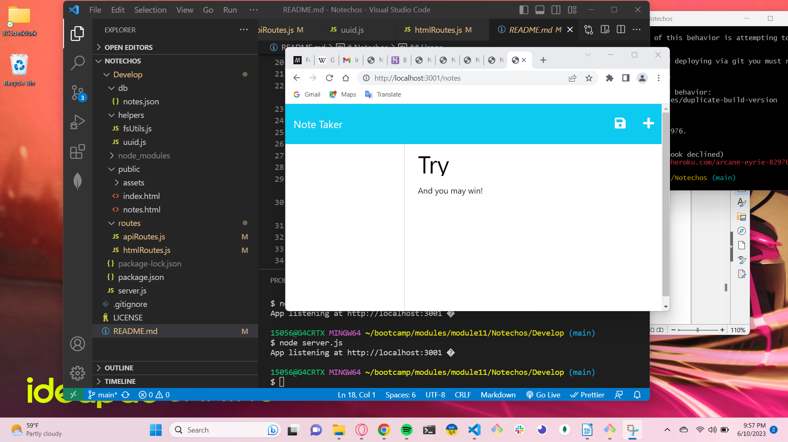

# Notechos

## Description:  
* The Notechos application is built for writing and saving notes to file. This enables a user to be organized and keep track of their ideas and retreive them later.
* Using an Express.js back end, data is saved and recalled from a JSON file. The user facing HTML interface lists the titles of saved notes to the left and their is an aempty field on the right  for the additio of a new note.
* As an app this may be used to integrate into other apps, or be used as a standalone to generate a note that will not persist when the application page is closed.
* A front to back end complete program deployed to heroku, Notechos codebase may be found in github.

## Installation

https://arcane-eyrie-82976.herokuapp.com

## Usage
>
> **Note**:
> From the terminal, navigate into Main folder:
```bash
node index.js
```
https://gdutra2002.github.io/Notechos/



## Credits
UC Davis Coding bootcamp is credited with the front end starter code.

## License
See MIT license


## Badges


### Features
>
>* HTML, CSS, github, npm inquery, APIs, JavaScript, Node.js, Express.js
>

## How to Contribute
Prefered method of contact: Linked-In.  <br>
Link to source:
https://github.com/gdutra2002    <br>
Contact author:
Profile
https://www.linkedin.com/in/gary-e-dutra-15357940/

---
© 2023 MRB Confidential and Proprietary. All Rights Reserved.

